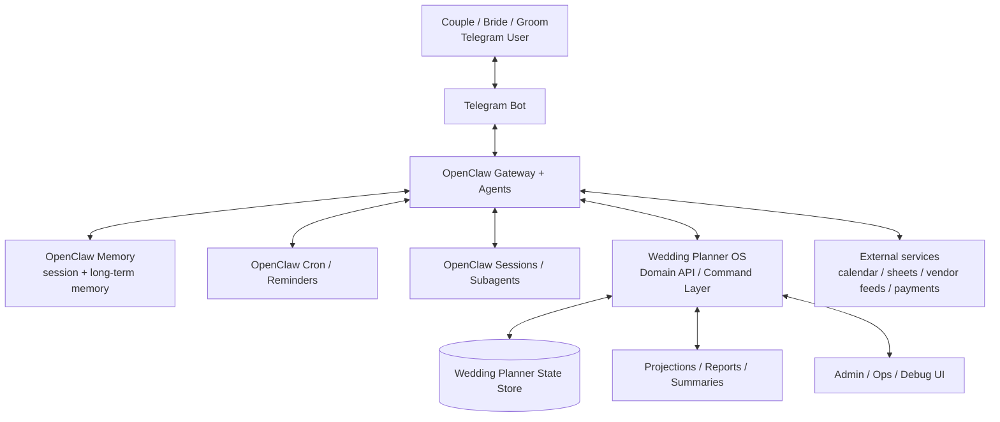
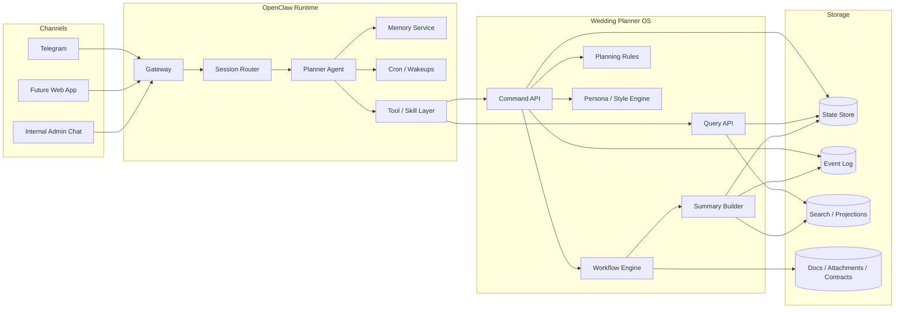
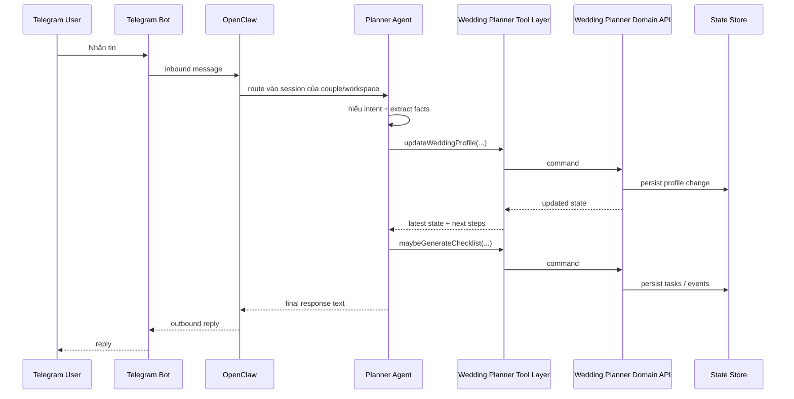
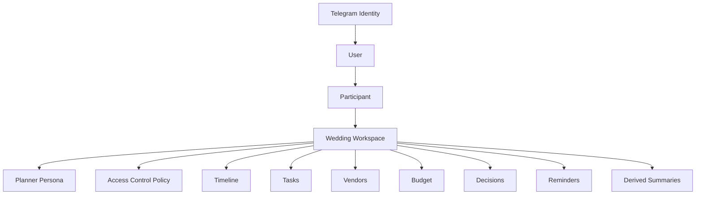

# Wedding Planner OS - Target Architecture

## Purpose

Tài liệu này mô tả **kiến trúc mục tiêu** của Wedding Planner OS theo hướng:

- **OpenClaw-centric orchestration**
- **Telegram-first, nhưng không Telegram-bound**
- **Wedding workspace là trung tâm domain**
- **Hỗ trợ nhiều planner persona, nhiều participant, nhiều kênh tương tác**

Mục tiêu là chuyển từ MVP webhook app/file-store hiện tại sang một hệ có thể vận hành thật cho nhiều cặp đôi, nhiều phong cách planner, và nhiều người cùng cộng tác trong một wedding workspace.

---

## Core architecture principle

> **Wedding Workspace là trung tâm domain. Telegram chỉ là transport + identity layer. OpenClaw là orchestration/runtime layer.**

Điều này giúp hệ thống support tốt:

- nhiều cô dâu/chú rể cùng dùng bot
- một đám cưới có nhiều participant
- một workspace có thể đổi planner persona
- nhiều kênh chat hoặc UI cùng truy cập một state chung

---

## High-level target architecture

---

## Container view

---

## Primary conversation flow

---

## Responsibilities by layer

### 1. Telegram / channel layer

Vai trò:

- nhận/gửi tin nhắn từ user
- là transport chính cho MVP và giai đoạn đầu
- không giữ business state làm trung tâm

Telegram chỉ nên đóng vai trò:

- **identity surface**
- **conversation surface**

Không nên để toàn bộ domain model bị khóa cứng vào Telegram chat.

---

### 2. OpenClaw orchestration layer

OpenClaw là runtime trung tâm và nên chịu trách nhiệm:

- route inbound message vào đúng session/workspace
- giữ continuity hội thoại
- gọi AI/agent
- gọi tool/domain command
- quản lý cron/reminders
- quản lý memory/session summaries
- hỗ trợ multi-agent/subagent workflows

OpenClaw không nên là nơi lưu canonical wedding state. Canonical state nên nằm ở Wedding Planner OS.

---

### 3. Wedding Planner OS domain layer

Đây là domain backend của sản phẩm. Nó nên cung cấp:

- **Command API**: đổi state
- **Query API**: đọc state
- **Workflow engine**: orchestrate business flows
- **Rules engine**: validate/risk detection
- **Persona engine**: style/policy presets
- **Projection layer**: summary, dashboards, derived views

---

## Domain-centric design principle

> **Mọi thứ xoay quanh `workspaceId`, không xoay quanh Telegram chat id.**

Lý do:

- cô dâu có thể add chú rể
- một người có thể đổi chat/channel
- có thể có group chat + DM cùng trỏ về một wedding workspace
- sau này có thể có web app/admin UI
- support nhiều participant sẽ gãy nếu Telegram chat là primary key domain

---

## Support for business requirements

Kiến trúc mục tiêu này được thiết kế để đáp ứng:

### A. Một planner tương tác với nhiều cô dâu/chú rể qua Telegram

Hỗ trợ bằng cách tách:

- Telegram identity
- User
- Participant
- Wedding workspace
- Session

### B. Nhiều wedding planner persona với các phong cách khác nhau

Ví dụ:

- hiện đại
- truyền thống
- lãng mạn
- tiết kiệm

Mỗi workspace có thể chọn một planner persona phù hợp.

### C. Cô dâu có thể add chú rể hay người liên quan để cùng trao đổi

Workspace phải hỗ trợ:

- nhiều participant
- role-based access
- shared conversation context
- collaboration qua DM hoặc group chat

---

## Domain model (target)

---

## Core entities

### User
Người dùng thật trong hệ thống.

Ví dụ:
- cô dâu
- chú rể
- người thân
- wedding planner operator

### Identity
Mapping từ channel vào user.

Ví dụ:
- Telegram user id
- Telegram chat id
- sau này có thể là web account / WhatsApp / email

### Participant
Một user trong ngữ cảnh một wedding workspace.

Ví dụ role:
- bride
- groom
- family
- planner
- vendor
- viewer

### Wedding Workspace
Aggregate/domain root cho một đám cưới.

Mọi domain state nên gắn vào đây.

### Planner Persona
Persona/policy cho phong cách tư vấn.

Ví dụ metadata:
- id
- displayName
- tone
- planningPrinciples
- checklist template
- rules preset
- prompt template
- style biases

---

## Planner persona model

Planner persona không chỉ là prompt name. Nó nên là một catalog data-driven.

Ví dụ:

- `modern`
- `traditional`
- `romantic`
- `budget-conscious`

Mỗi persona có thể định nghĩa:

- response tone
- planning priorities
- recommendation biases
- starter checklist template
- wording style
- escalation rules
- summary style

---

## Session strategy

Kiến trúc mục tiêu phải hỗ trợ song song:

### 1. DM-first mode
Mỗi participant chat riêng với bot.

- bride DM bot
- groom DM bot
- cả hai đều gắn về cùng một `workspaceId`

### 2. Group collaboration mode
Bot ở trong nhóm Telegram chung.

- group/topic được bind vào workspace
- nhiều participant cùng trao đổi

### Recommendation

- **DM là primary interaction mode**
- **Group là collaboration layer bổ sung**

---

## Command / Query split

### Command API
Các hành động đổi state, ví dụ:

- `createWorkspace`
- `linkIdentity`
- `addParticipant`
- `assignPlannerPersona`
- `updateWeddingProfile`
- `addDecision`
- `scheduleReminder`
- `addVendorCandidate`
- `replaceChecklist`

### Query API
Các hành động đọc state, ví dụ:

- `getWorkspaceSnapshot`
- `getSummary`
- `getTimelineView`
- `getBudgetView`
- `getVendorBoard`
- `getUpcomingReminders`
- `getParticipantList`

---

## Workflow engine responsibilities

Workflow engine nên chịu trách nhiệm cho các luồng như:

- onboarding couple
- chọn planner persona
- venue selection flow
- vendor shortlist flow
- ngân sách vs khách vs venue fit
- checklist generation
- reminder scheduling
- decision follow-ups

---

## Rules engine responsibilities

Rules engine nên phát hiện:

- ngân sách không khớp số khách
- deadline cận kề
- venue không khớp phong cách/planner bias
- task dependencies bị thiếu
- data confidence còn thấp
- các rủi ro planning cần escalate

---

## Data/storage target

State store có thể bắt đầu bằng file-based như hiện tại, nhưng target design nên tách:

- canonical state
- event log
- projections/read models
- generated docs

Ví dụ:

- `workspace state`
- `participant list`
- `budget ledger`
- `timeline`
- `vendor board`
- `decision log`
- `summary projections`
- `conversation references`

---

## OpenClaw vs Wedding Planner OS boundary

### OpenClaw nên giữ

- channel integration
- session continuity
- AI reasoning
- reminders / cron
- memory
- subagent orchestration

### Wedding Planner OS nên giữ

- canonical business state
- command/query contracts
- workflow rules
- projections
- audit/event log
- admin/reporting APIs

---

## Current MVP vs target architecture

### Current MVP

- Telegram webhook route gọi thẳng vào `PlannerService`
- file-based persistence
- persona/checklist còn hardcoded một phần
- OpenClaw chưa đóng vai runtime/orchestrator trung tâm

### Target

- Telegram vào OpenClaw trước
- OpenClaw route vào đúng session/workspace
- agent invoke domain commands qua tool layer
- Wedding Planner OS là domain backend rõ ràng
- có command/query/workflow split
- có participant model + persona catalog + reminder orchestration

---

## Migration direction

### Phase 1
- giữ file store
- tách command/query rõ hơn
- biến planner logic thành domain commands

### Phase 2
- đưa OpenClaw thành front door chính cho Telegram interactions
- session binding theo workspace

### Phase 3
- thêm participant collaboration model
- support bride/groom/family cùng làm việc

### Phase 4
- thêm projections/admin UI/vendor intelligence/reminders nâng cao

---

## Final summary

> **Target architecture của Wedding Planner OS là một hệ OpenClaw-centric conversational orchestration, trong đó OpenClaw quản lý channel/session/AI/reminders, còn Wedding Planner OS quản lý canonical wedding domain state, workflows, planner personas, participants và projections.**

> **Workspace là domain center. Telegram chỉ là transport.**
