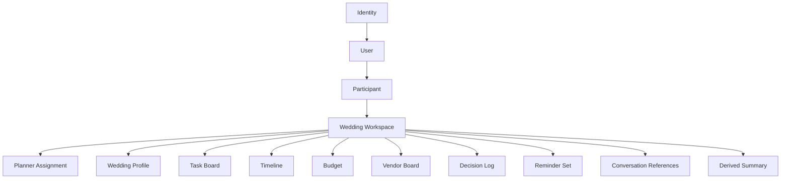
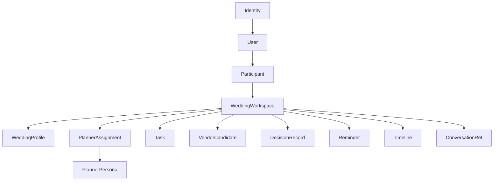

# Wedding Planner OS - Domain Model

## Purpose

Tài liệu này mô tả **domain model mục tiêu** cho Wedding Planner OS.

Mục tiêu của model này là support tốt các nhu cầu cốt lõi:

- nhiều cô dâu/chú rể cùng dùng hệ thống
- nhiều participant trong cùng một đám cưới
- nhiều planner persona với phong cách khác nhau
- nhiều kênh tương tác, trong đó Telegram là kênh đầu tiên
- OpenClaw orchestration nhưng domain state vẫn rõ ràng, bền vững và độc lập transport

---

## Core domain principle

> **Wedding Workspace là aggregate root trung tâm.**

Mọi state nghiệp vụ quan trọng đều phải quy chiếu về `workspaceId`.

Không lấy:
- Telegram chat id
- Telegram user id
- session key

làm primary domain root.

---

## Core aggregate map



---

## Entity catalogue

## 1. User

### Meaning
Một con người thật trong hệ thống.

### Examples
- cô dâu
- chú rể
- người thân
- wedding planner operator
- cộng tác viên

### Suggested fields

```ts
User {
  id: string
  displayName: string
  roleClass: 'client' | 'internal' | 'vendor' | 'viewer'
  timezone: string
  language: string
  status: 'active' | 'inactive'
  createdAt: ISODateTime
  updatedAt: ISODateTime
}
```

### Notes
- `User` là identity-independent
- Một user có thể có nhiều identity
- Một user có thể tham gia nhiều workspace theo thời gian

---

## 2. Identity

### Meaning
Một binding giữa user và một kênh truy cập.

### Current primary identity type
- Telegram

### Future identity types
- web account
- WhatsApp
- internal admin account

### Suggested fields

```ts
Identity {
  id: string
  userId: string
  platform: 'telegram' | 'web' | 'whatsapp' | 'internal'
  platformUserId: string
  platformChatId?: string
  username?: string
  displayHandle?: string
  verified: boolean
  linkedAt: ISODateTime
  lastSeenAt?: ISODateTime
  metadata?: Record<string, unknown>
}
```

### Notes
- Một user có thể có nhiều identity
- Identity là lớp transport mapping, không phải domain root

---

## 3. Wedding Workspace

### Meaning
Không gian domain của **một đám cưới**.

Đây là aggregate root quan trọng nhất.

### Suggested fields

```ts
WeddingWorkspace {
  id: string
  title: string
  status: 'draft' | 'active' | 'paused' | 'archived' | 'completed'
  ownerUserIds: string[]
  primaryContactUserId?: string
  createdAt: ISODateTime
  updatedAt: ISODateTime
  archivedAt?: ISODateTime
  tags?: string[]
}
```

### Notes
- Một workspace đại diện cho một cặp đôi / một wedding plan
- Một workspace có thể có nhiều participant
- Một workspace có đúng một planner persona active tại một thời điểm, nhưng có thể đổi theo thời gian

---

## 4. Participant

### Meaning
Một user trong ngữ cảnh của một workspace.

User là người thật.
Participant là vai trò của người đó trong một đám cưới cụ thể.

### Suggested fields

```ts
Participant {
  id: string
  workspaceId: string
  userId: string
  role: 'bride' | 'groom' | 'family' | 'planner' | 'assistant' | 'vendor' | 'viewer'
  permissions: string[]
  invitationStatus: 'pending' | 'accepted' | 'declined' | 'removed'
  joinedAt?: ISODateTime
  invitedBy?: string
  metadata?: Record<string, unknown>
}
```

### Why important
Đây là entity bắt buộc để support:
- cô dâu add chú rể
- thêm người thân cùng trao đổi
- phân quyền ai xem/sửa cái gì

---

## 5. Planner Persona

### Meaning
Phong cách planner mà workspace chọn để tương tác.

### Examples
- modern
- traditional
- romantic
- budget-conscious

### Suggested fields

```ts
PlannerPersona {
  id: string
  displayName: string
  styleLabel: string
  tone: 'warm' | 'practical' | 'formal' | 'playful' | 'traditional'
  planningPrinciples: string[]
  summaryStyle: string
  defaultChecklistTemplateId?: string
  promptTemplateId?: string
  rulesPresetId?: string
  biases?: {
    budget?: number
    aesthetic?: number
    tradition?: number
    guestExperience?: number
  }
  active: boolean
}
```

### Notes
- Persona là **data-driven catalog**, không nên chỉ hardcode trong code
- Persona ảnh hưởng recommendation style và workflow priority
- Persona không nên phá vỡ canonical state shape

---

## 6. Planner Assignment

### Meaning
Record gắn planner persona hiện tại cho workspace.

### Suggested fields

```ts
PlannerAssignment {
  workspaceId: string
  plannerPersonaId: string
  assignedAt: ISODateTime
  assignedBy: string
  mode: 'ai' | 'human-assisted'
}
```

---

## 7. Wedding Profile

### Meaning
Snapshot của các thông tin nền tảng về đám cưới.

### Suggested fields

```ts
WeddingProfile {
  workspaceId: string
  eventDate?: ISODate
  datePrecision?: 'exact' | 'month-only' | 'seasonal' | 'unknown'
  city?: string
  regions?: string[]
  venuePreference?: string[]
  budgetTarget?: number
  budgetCurrency?: string
  guestTarget?: number
  styleNotes?: string[]
  rituals?: string[]
  confidence?: Record<string, 'draft' | 'estimated' | 'confirmed'>
  updatedAt: ISODateTime
}
```

### Notes
- `confidence` rất hữu ích cho planner AI
- nên support data incomplete trong giai đoạn đầu

---

## 8. Budget Model

### Meaning
Quản lý ngân sách chi tiết, không chỉ một con số target.

### Suggested fields

```ts
BudgetEnvelope {
  workspaceId: string
  totalTarget?: number
  currency: string
  categories: BudgetCategory[]
  updatedAt: ISODateTime
}

BudgetCategory {
  id: string
  name: string
  planned?: number
  actual?: number
  reserved?: number
  notes?: string[]
}
```

### Future value
- compare venue/vendor fit
- detect overspend risk
- generate savings suggestions

---

## 9. Task Board / Checklist

### Meaning
Tập hợp các task planning cần làm.

### Suggested fields

```ts
Task {
  id: string
  workspaceId: string
  title: string
  category: string
  status: 'open' | 'in_progress' | 'blocked' | 'done' | 'cancelled'
  priority: 'high' | 'medium' | 'low'
  assignedParticipantId?: string
  dueAt?: ISODateTime
  createdAt: ISODateTime
  updatedAt: ISODateTime
  source?: 'template' | 'ai' | 'manual' | 'workflow'
  dependsOn?: string[]
}
```

### Notes
- Checklist chỉ là một dạng view của task board
- Về sau task cần support dependency, owner, blocker

---

## 10. Vendor Board

### Meaning
Danh sách vendor và tiến độ làm việc với từng vendor.

### Suggested fields

```ts
VendorCandidate {
  id: string
  workspaceId: string
  type: 'venue' | 'photo' | 'video' | 'mc' | 'makeup' | 'florist' | 'planner' | 'other'
  name: string
  city?: string
  priceRange?: {
    min?: number
    max?: number
    currency?: string
  }
  rating?: number
  styleTags?: string[]
  contactInfo?: Record<string, string>
  status: 'lead' | 'shortlisted' | 'contacted' | 'negotiating' | 'booked' | 'rejected'
  notes?: string[]
  createdAt: ISODateTime
  updatedAt: ISODateTime
}
```

---

## 11. Timeline

### Meaning
Các milestone lớn của hành trình chuẩn bị cưới.

### Suggested fields

```ts
Timeline {
  workspaceId: string
  milestones: Milestone[]
  updatedAt: ISODateTime
}

Milestone {
  id: string
  title: string
  dueAt?: ISODateTime
  category: string
  status: 'planned' | 'active' | 'done' | 'skipped'
  relatedTaskIds?: string[]
}
```

---

## 12. Decision Log

### Meaning
Lưu các quyết định quan trọng để planner AI không quên.

### Suggested fields

```ts
DecisionRecord {
  id: string
  workspaceId: string
  title: string
  summary: string
  category: string
  chosenOption?: string
  rationale?: string
  decidedByParticipantIds?: string[]
  decidedAt: ISODateTime
}
```

### Why important
Đây là cầu nối rất tốt giữa:
- domain state
- OpenClaw memory
- future explainability

---

## 13. Reminder Set

### Meaning
Các nhắc việc có deadline hoặc theo lịch.

### Suggested fields

```ts
Reminder {
  id: string
  workspaceId: string
  title: string
  detail?: string
  dueAt?: ISODateTime
  recurrence?: string
  status: 'scheduled' | 'sent' | 'completed' | 'cancelled'
  targetParticipantIds?: string[]
  createdAt: ISODateTime
  updatedAt: ISODateTime
}
```

### Notes
- phần scheduling runtime có thể do OpenClaw cron đảm nhiệm
- nhưng canonical reminder record vẫn nên ở Wedding Planner OS

---

## 14. Conversation Reference

### Meaning
Tham chiếu conversation, không nhất thiết lưu full transcript trong canonical state.

### Suggested fields

```ts
ConversationRef {
  id: string
  workspaceId: string
  platform: 'telegram'
  sessionKey?: string
  transportChatId?: string
  kind: 'dm' | 'group' | 'topic'
  active: boolean
  lastMessageAt?: ISODateTime
}
```

### Why important
Phân biệt rõ:
- domain state
- transport/session mapping

---

## 15. Derived Summary / Projection

### Meaning
Các read model phục vụ phản hồi nhanh, dashboard, recap.

### Examples
- latest-state
- summary markdown
- next best action
- open task count
- budget risk snapshot

### Notes
Projection không phải canonical source of truth.

---

## Access control model

Tối thiểu cần 3 lớp quyền:

### Workspace-level permissions
Ví dụ:
- `workspace.read`
- `workspace.write`
- `participants.invite`
- `planner.switch`
- `budget.edit`
- `timeline.edit`

### Role presets
Ví dụ:
- bride: full access
- groom: full access
- family: partial access
- viewer: read-only
- planner: operational access

### Policy rules
Ví dụ:
- ai được mời thêm participant
- ai được đổi planner persona
- ai được xác nhận quyết định cuối cùng

---

## Identity and participant rules

### Rule 1
Một `User` có thể có nhiều `Identity`.

### Rule 2
Một `Workspace` có nhiều `Participant`.

### Rule 3
Một `Participant` luôn gắn với đúng một `Workspace`.

### Rule 4
Một `User` có thể là participant trong nhiều workspace khác nhau theo thời gian.

### Rule 5
Một `Identity` không được tự đại diện cho workspace; nó chỉ là cửa vào.

---

## Session model recommendation

### DM session
- bind theo `user identity` + `workspace`
- phù hợp cho trao đổi riêng

### Group session
- bind theo `transport group/topic` + `workspace`
- phù hợp cho collaboration

### Canonical rule
Session chỉ là lớp runtime của OpenClaw. Workspace mới là lớp domain thật.

---

## Example target schema map



---

## What should be canonical vs derived

### Canonical
- users
- identities
- participants
- workspace
- planner assignment
- profile
- task board
- vendor board
- decisions
- reminders
- timeline

### Derived / projection
- latest-state snapshot
- summary markdown
- unread recap
- next best action
- budget risk score
- planner recommendation summary

---

## What should live in OpenClaw memory instead of canonical domain state

OpenClaw memory nên giữ các thứ conversational/behavioral như:

- tone preference của couple
- cách xưng hô
- gu phản hồi dài/ngắn
- sở thích aesthetic tinh tế
- các nuance hội thoại

Wedding Planner OS nên giữ canonical facts như:

- ngày cưới
- ngân sách
- participant list
- vendor shortlist
- decisions
- reminders

---

## Evolution recommendation

### Current skeleton gap
Source hiện tại còn thiếu các lớp domain sau:

- Participant
- Access policy
- Budget envelope đầy đủ
- Vendor board hoàn chỉnh
- Decision log thực sự
- Reminder model thực sự
- Persona catalog data-driven

### Recommended next modeling step
Triển khai theo thứ tự:

1. `Participant`
2. `PlannerPersona` + `PlannerAssignment`
3. `ConversationRef`
4. `DecisionRecord`
5. `Reminder`
6. `BudgetEnvelope`
7. `VendorCandidate`

---

## Final summary

> **Domain model mục tiêu của Wedding Planner OS lấy `WeddingWorkspace` làm aggregate root, với `User` và `Identity` là lớp truy cập, `Participant` là lớp cộng tác, `PlannerPersona` là lớp phong cách điều phối, và các module như profile/tasks/vendors/timeline/decisions/reminders là các thành phần domain gắn vào workspace.**

> **Telegram chỉ là identity + transport. OpenClaw session chỉ là runtime. Workspace mới là domain center.**
