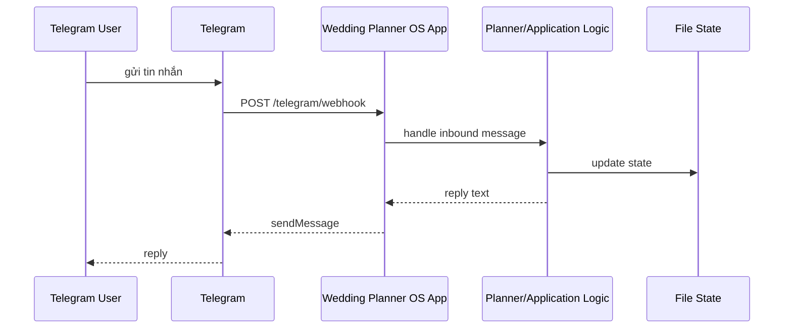
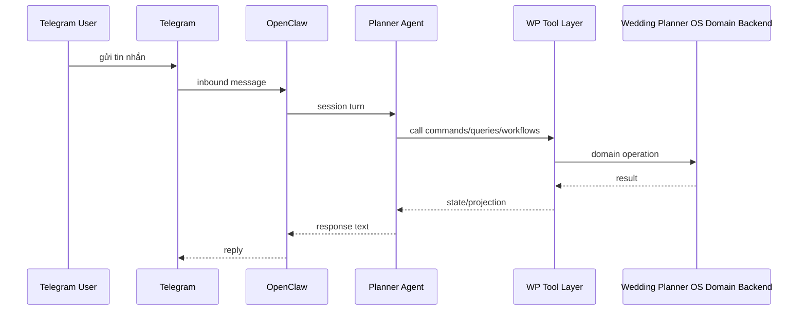

# Wedding Planner OS - Implementation Gap

## Purpose

Tài liệu này mô tả khoảng cách giữa:

- **current implementation** của Wedding Planner OS
- và **target architecture** đã đặc tả trong `_ARCHITECTURE.md`

Mục tiêu là trả lời rõ:

- hiện code đang ở đâu
- kiến trúc mục tiêu muốn gì
- lệch ở đâu
- phải refactor theo thứ tự nào để đi từ current state sang target state

---

## Executive summary

### Current state
Wedding Planner OS hiện tại là một **working MVP skeleton** theo mô hình:

```text
Telegram bot -> webhook -> wedding-planner-os app -> application/domain logic -> file state
```

### Target state
Kiến trúc mục tiêu muốn hệ chạy theo mô hình:

```text
Telegram bot -> OpenClaw -> planner agent/runtime -> wedding-planner-os command/query/workflow layer -> canonical state
```

### Core gap
> **Current implementation đang để Wedding Planner OS app làm message receiver/orchestrator. Target architecture yêu cầu OpenClaw làm message receiver/orchestrator.**

Đây là khoảng cách lớn nhất và quan trọng nhất.

---

## What the target architecture says

Theo `_ARCHITECTURE.md`, Wedding Planner OS được đặc tả như sau:

### Principle
- Telegram là **transport + identity surface**
- OpenClaw là **orchestration/runtime layer**
- Wedding Planner OS là **domain backend**
- Domain center là **`workspaceId`**, không phải Telegram chat

### Implication
Điều đó đồng nghĩa:
- Telegram message nên vào OpenClaw trước
- OpenClaw mới là nơi giữ session continuity và AI reasoning
- Wedding Planner OS không nên là bot runtime chính về lâu dài

---

## Current implementation overview

Hiện tại code base đang làm được:

- nhận webhook Telegram tại app
- parse text inbound cơ bản
- tạo user + workspace
- update profile
- switch planner (`mina`, `luna`)
- generate starter checklist
- rebuild summary/latest-state
- gửi reply lại Telegram

### Current runtime flow



---

## Target runtime flow



---

## Gap analysis by concern

# 1. Ingress / message entrypoint

## Current
- Telegram webhook trỏ thẳng vào `wedding-planner-os`
- app này trực tiếp nhận message user

## Target
- Telegram phải trỏ vào OpenClaw
- OpenClaw mới là entrypoint nhận message

## Gap
**Rất lớn**

### Why it matters
Nếu không đổi ingress:
- OpenClaw không có session continuity thật
- memory/cron/subagent không nằm ở front door
- dễ sinh hai runtime song song

### Refactor direction
- chuyển webhook target về OpenClaw
- biến `wedding-planner-os` thành backend/tool target

---

# 2. Orchestration ownership

## Current
- orchestration conversation đang nằm trong app code
- `telegram.routes.ts` + `PlannerService` + application handler đang điều phối flow chính

## Target
- OpenClaw giữ orchestration
- Wedding Planner OS chỉ giữ command/query/workflow domain contracts

## Gap
**Lớn**

### Why it matters
Nếu app backend vẫn orchestrate conversation, OpenClaw chỉ trở thành lớp ngoài trang trí, không phải runtime thực.

### Refactor direction
- giảm conversational branching trong app
- expose domain contracts rõ ràng hơn
- để OpenClaw agent chọn command/query cần gọi

---

# 3. Domain boundary clarity

## Current
- đã bắt đầu refactor phase 1
- có `application/commands`, `application/queries`, `application/handlers`
- nhưng state gateway vẫn còn ôm nhiều trách nhiệm

## Target
- command/query/workflow layer rõ ràng
- persistence chỉ là persistence
- workflow/rules/policies tách bạch

## Gap
**Trung bình**

### Positive note
Đây là phần đã bắt đầu đi đúng hướng.

### Remaining issues
- `WorkspaceStateGateway` còn fat
- command model mới chỉ cover một phần use cases
- workflow layer gần như chưa có

---

# 4. Session model

## Current
- runtime session thực tế gắn mạnh với Telegram inbound flow
- domain chưa có conversation binding model hoàn chỉnh

## Target
- session runtime do OpenClaw quản lý
- session phải map về `workspaceId`
- support DM + group/topic + participant collaboration

## Gap
**Lớn**

### Missing pieces
- conversation refs
- participant-aware session routing
- workspace binding strategy

---

# 5. Participant collaboration

## Current
- mới support 1 Telegram identity -> 1 user -> 1 active workspace
- chưa có participant model thật

## Target
- 1 workspace có nhiều participant
- bride có thể add groom/family
- role-based access control

## Gap
**Rất lớn**

### Missing pieces
- `participants.json`
- invitation flow
- participant permissions
- access policy enforcement

---

# 6. Planner persona model

## Current
- persona còn hardcoded phần runtime (`mina`, `luna`)
- dù đã có `data/personas/*`

## Target
- persona catalog data-driven
- planner persona ảnh hưởng prompt policy, workflow priority, checklist defaults

## Gap
**Trung bình**

### Missing pieces
- load persona catalog từ data
- gắn persona vào prompt policy contract cho OpenClaw
- bỏ phụ thuộc hardcoded runtime behavior

---

# 7. Reminder orchestration

## Current
- có file `reminders.json`
- nhưng chưa có reminder workflow/runtime thật

## Target
- canonical reminder state ở Wedding Planner OS
- scheduling runtime ở OpenClaw cron
- reconciliation giữa domain state và cron jobs

## Gap
**Lớn**

### Missing pieces
- reminder command/query model
- cron sync layer
- reconciliation workflow

---

# 8. OpenClaw integration layer

## Current
- chưa có `src/infrastructure/integrations/openclaw/`
- chưa có tool contract implementation cụ thể

## Target
- có bridge rõ ràng giữa OpenClaw và Wedding Planner OS
- có session binding, memory sync, cron sync, prompt policy

## Gap
**Rất lớn**

### Missing pieces
- `openclaw-tools.ts`
- `session-binding.ts`
- `memory-sync.ts`
- `cron-sync.ts`
- `agent-prompt-policy.ts`

---

# 9. Data semantics

## Current
Data shape MVP khá sạch nhưng còn vài chỗ semantic debt:
- `eventDate` đang đại diện cho month-only fact
- budget chưa có currency
- task chưa có `source`
- summary formatting còn raw

## Target
Data model nên chính xác ngữ nghĩa hơn.

## Gap
**Nhỏ đến trung bình**

### Good news
Đây là loại gap sửa khá rẻ.

---

## Gap severity summary

| Concern | Severity |
|---|---|
| Ingress ownership | Very High |
| Orchestration ownership | Very High |
| Session/workspace binding | High |
| Participant model | Very High |
| OpenClaw integration layer | Very High |
| Reminder orchestration | High |
| Persona data-driven model | Medium |
| Domain boundary extraction | Medium |
| Data semantics cleanup | Medium-Low |

---

## What has already improved

Những bước đã làm đúng hướng:

- viết `_ARCHITECTURE.md`
- viết `_DOMAIN_MODEL.md`
- viết `_MIGRATION_PLAN.md`
- viết `_OPENCLAW_INTEGRATION_SPEC.md`
- viết `_SRC_TARGET_TREE.md`
- refactor phase 1 một phần sang application layer
- làm MVP local/mock chạy được

Điều này rất quan trọng vì:
- current system không còn mù mờ
- target system đã có spec rõ
- khoảng cách current -> target đã thấy được bằng tài liệu

---

## Recommended transition model

Không nên nhảy một phát từ current sang target. Nên đi theo mô hình chuyển tiếp.

## Transitional architecture

```text
Telegram/OpenClaw ingress
  -> OpenClaw runtime
  -> Wedding Planner OS command/query/workflow contracts
  -> canonical state store
```

Trong giai đoạn chuyển tiếp, có thể tạm giữ app server để:
- expose admin/query endpoints
- phục vụ internal tool access
- support debug routes

Nhưng không nên giữ nó làm bot ingress lâu dài.

---

## Recommended next steps

# Step 1 - Finish phase 1 refactor
- tách thêm commands/queries/workflows
- làm `WorkspaceStateGateway` mỏng hơn
- chuẩn hóa command outputs

# Step 2 - Build OpenClaw integration layer
- tạo `src/infrastructure/integrations/openclaw/`
- define tool contract implementations
- define session/workspace binding strategy

# Step 3 - Move ingress to OpenClaw
- Telegram webhook trỏ về OpenClaw
- OpenClaw agent gọi Wedding Planner OS tools
- app không còn làm inbound conversation receiver chính

# Step 4 - Add participant model
- participants
- invitation flow
- access policy
- DM/group collaboration support

# Step 5 - Add reminders + cron sync
- domain reminder records
- OpenClaw cron integration
- reminder reconciliation

---

## Anti-patterns to avoid during migration

### 1. Dual runtime forever
Không nên để lâu tình trạng:
- một số message vào OpenClaw
- một số message vào app trực tiếp

### 2. Business logic split across prompt and route spaghetti
Prompt có thể giúp reasoning, nhưng canonical business logic phải nằm ở domain contracts.

### 3. Telegram-first domain modeling
Không dùng Telegram chat id làm root của domain.

### 4. Overloading OpenClaw memory with canonical facts
Canonical facts phải được write vào Wedding Planner OS state.

---

## Definition of architectural alignment

Repo được coi là aligned với `_ARCHITECTURE.md` khi:

- Telegram message vào OpenClaw trước
- OpenClaw là nơi giữ session continuity
- Wedding Planner OS cung cấp command/query/workflow contracts rõ ràng
- `workspaceId` là trung tâm mọi domain operation
- participant model hoạt động
- planner persona là data-driven
- reminders chạy qua OpenClaw cron nhưng sync về domain state

---

## Final summary

> **Khoảng cách lớn nhất giữa current implementation và target architecture là quyền sở hữu ingress/orchestration: hiện tại Wedding Planner OS app đang nhận và điều phối message, trong khi kiến trúc mục tiêu yêu cầu OpenClaw làm điều đó.**

> **Phần đúng hướng nhất đã có là domain refactor bước đầu. Phần quan trọng nhất còn thiếu là OpenClaw integration layer, session/workspace binding, participant model và việc chuyển Telegram ingress sang OpenClaw.**
