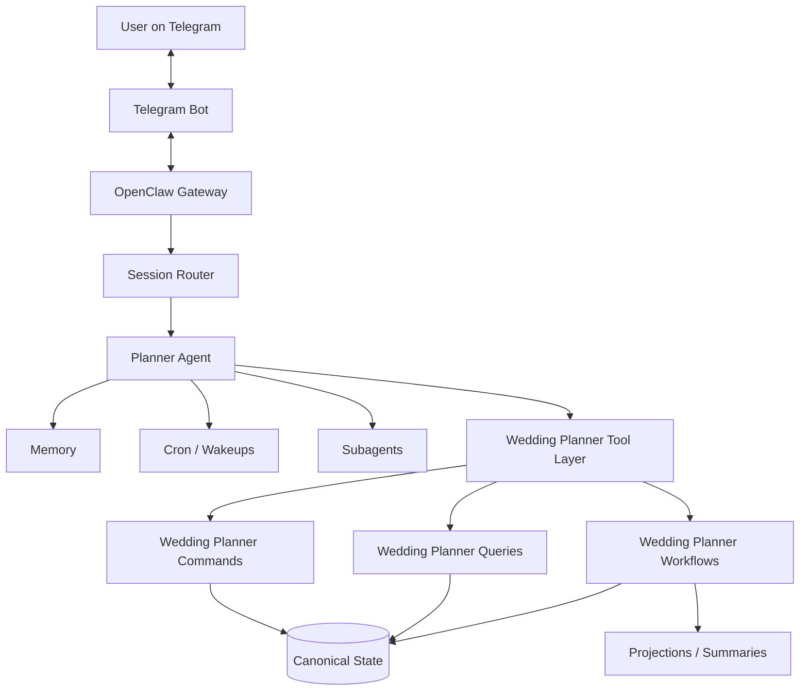
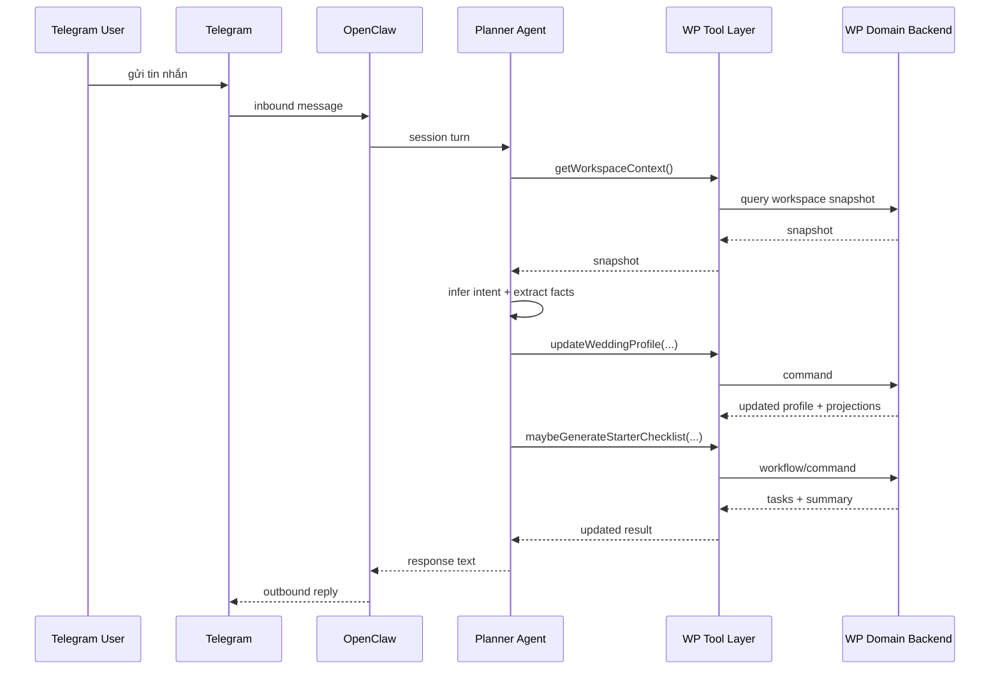
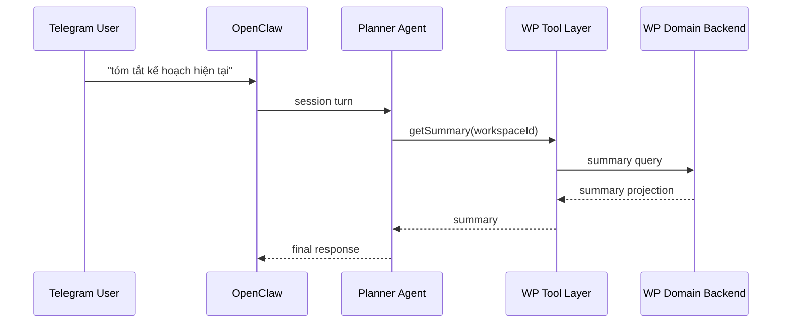
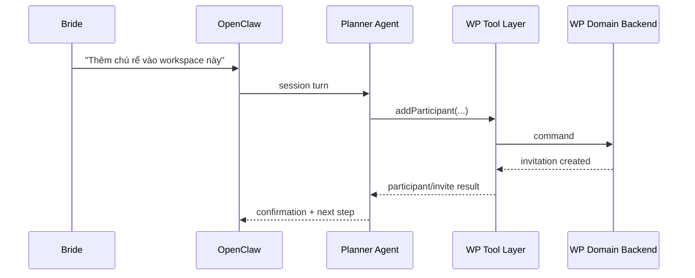

# Wedding Planner OS - OpenClaw Integration Spec

## Purpose

Tài liệu này mô tả cách tích hợp Wedding Planner OS với OpenClaw theo mô hình mục tiêu:

- **OpenClaw là entrypoint nhận message từ user**
- **OpenClaw là orchestration/runtime layer**
- **Wedding Planner OS là domain backend**
- **Telegram chỉ là transport/identity surface**

Spec này nhằm trả lời câu hỏi:

> Khi refactor kiến trúc, chính xác thì OpenClaw sẽ làm gì, Wedding Planner OS sẽ làm gì, message sẽ chảy như thế nào, và ranh giới giữa hai bên ở đâu?

---

## Core integration principle

> **OpenClaw nhận message, hiểu ngữ cảnh, quản lý session, gọi AI/tool/cron. Wedding Planner OS lưu và xử lý canonical wedding domain state qua command/query/workflow contracts.**

Nói gọn:

- **OpenClaw = conversational runtime**
- **Wedding Planner OS = wedding domain platform**

---

## Problem this spec solves

MVP hiện tại xử lý theo kiểu:

```text
Telegram webhook -> Fastify route -> PlannerService -> file state
```

Mô hình này chạy được cho MVP nhưng có hạn chế:

- conversation orchestration nằm trong app backend
- khó gắn memory/cron/subagents của OpenClaw
- khó mở rộng participant collaboration
- khó chuẩn hóa command/query boundaries
- khó tách transport khỏi domain

Spec này chuyển hệ sang mô hình:

```text
Telegram -> OpenClaw -> Wedding Planner OS command/query/workflow layer
```

---

## High-level architecture



---

## System boundary

## OpenClaw responsibilities

OpenClaw nên chịu trách nhiệm cho các phần sau:

### 1. Channel ingress
- nhận inbound message từ Telegram
- route message vào đúng session
- support DM hoặc group/topic context

### 2. Session continuity
- duy trì history hội thoại
- binding session với wedding workspace
- phân biệt context bride/groom/family/group

### 3. AI reasoning
- hiểu intent
- trích facts từ tin nhắn
- chọn tool phù hợp
- quyết định khi nào hỏi lại, khi nào update state, khi nào summarize

### 4. Memory
- lưu conversational preferences
- lưu soft context/tone
- lưu lessons cho agent

### 5. Cron/reminders runtime
- schedule nhắc việc
- wake đúng lúc
- gửi follow-up chủ động

### 6. Multi-agent orchestration
- budget analysis subagent
- vendor research subagent
- summary/review subagent

---

## Wedding Planner OS responsibilities

Wedding Planner OS nên chịu trách nhiệm cho:

### 1. Canonical domain state
- users
- identities
- participants
- workspaces
- planner assignment
- profile
- tasks
- vendors
- decisions
- reminders
- timeline

### 2. Domain commands
- đổi state có kiểm soát
- validate input
- enforce business rules

### 3. Domain queries
- trả workspace snapshot
- summary
- budget view
- participant list
- vendor shortlist
- next best action backing data

### 4. Workflows
- onboarding
- participant invitation
- checklist bootstrap
- reminder reconciliation
- vendor follow-up workflows

### 5. Projections
- latest-state
- summary markdown
- dashboard snapshots
- risk views

---

## Integration boundary

### OpenClaw should NOT
- trở thành canonical source of truth cho wedding domain
- trực tiếp giữ raw wedding state lâu dài trong session memory
- encode toàn bộ business rules chỉ bằng prompt

### Wedding Planner OS should NOT
- tự trở thành full conversation orchestrator như bot runtime chính
- tự quản lý complex conversational memory thay cho OpenClaw
- hard-wire toàn bộ logic vào Telegram transport

---

## Message flow (target)

## Flow A - User sends planning message

Ví dụ user nhắn:

> “Bọn mình cưới tháng 12 ở Hà Nội, ngân sách 300 triệu, khoảng 250 khách”



---

## Flow B - User asks for summary



---

## Flow C - User adds another participant



---

## Session binding model

## Canonical rule

> **Session runtime ở OpenClaw phải map về `workspaceId`.**

### Why
Nếu không bind về workspace, hệ sẽ khó support:
- nhiều participant
- DM + group hybrid
- nhiều kênh transport
- long-term collaboration

### Recommended binding types

#### 1. Direct message binding
Map:
- `telegram user identity` + `workspaceId`

#### 2. Group/topic binding
Map:
- `telegram group/topic` + `workspaceId`

#### 3. Internal operator binding
Map:
- admin/internal chat + workspaceId

---

## Conversation routing policy

OpenClaw cần một lớp routing policy để trả lời các câu hỏi:

- message này thuộc workspace nào?
- sender có quyền truy cập workspace đó không?
- đây là DM hay group context?
- có cần tạo workspace mới không?
- có cần yêu cầu xác minh participant không?

### Recommended routing steps

1. identify sender identity
2. resolve linked user
3. resolve active or target workspace
4. authorize sender against participant list
5. load workspace snapshot/projections
6. hand off to planner agent

---

## Tool contract model

OpenClaw không nên chạm trực tiếp vào file state. Thay vào đó, nó nên gọi tool contracts rõ ràng.

## Tool categories

### Read tools (queries)
- `wp.getWorkspaceSnapshot`
- `wp.getSummary`
- `wp.getParticipantList`
- `wp.getPlannerPersona`
- `wp.getBudgetSummary`
- `wp.getTaskBoard`
- `wp.getUpcomingReminders`

### Write tools (commands)
- `wp.updateWeddingProfile`
- `wp.assignPlannerPersona`
- `wp.addParticipant`
- `wp.recordDecision`
- `wp.scheduleReminder`
- `wp.addVendorCandidate`
- `wp.completeTask`

### Workflow tools
- `wp.runOnboardingFlow`
- `wp.generateStarterChecklist`
- `wp.reconcileReminders`
- `wp.rebuildSummary`

---

## Example command contracts

## `wp.updateWeddingProfile`

### Input
```json
{
  "workspaceId": "wed_xxx",
  "patch": {
    "city": "Hà Nội",
    "eventMonth": "2026-12",
    "datePrecision": "month-only",
    "budgetTarget": 300000000,
    "budgetCurrency": "VND",
    "guestTarget": 250
  },
  "source": {
    "platform": "telegram",
    "sessionKey": "...",
    "actorUserId": "usr_xxx"
  }
}
```

### Output
```json
{
  "workspaceId": "wed_xxx",
  "profile": {"...": "..."},
  "changedFields": ["city", "eventMonth", "budgetTarget", "guestTarget"],
  "summaryUpdated": true
}
```

---

## `wp.assignPlannerPersona`

### Input
```json
{
  "workspaceId": "wed_xxx",
  "plannerPersonaId": "romantic",
  "actorUserId": "usr_xxx"
}
```

### Output
```json
{
  "workspaceId": "wed_xxx",
  "plannerPersonaId": "romantic",
  "assignedAt": "2026-04-05T10:00:00Z"
}
```

---

## `wp.addParticipant`

### Input
```json
{
  "workspaceId": "wed_xxx",
  "invitee": {
    "platform": "telegram",
    "platformUserId": "123456789"
  },
  "role": "groom",
  "actorUserId": "usr_xxx"
}
```

### Output
```json
{
  "workspaceId": "wed_xxx",
  "participantId": "part_xxx",
  "invitationStatus": "pending"
}
```

---

## Query contract examples

## `wp.getWorkspaceSnapshot`

### Output should include
- workspace metadata
- planner assignment
- profile snapshot
- open tasks count
- next important task
- budget summary (if any)
- participant list summary
- summary freshness metadata

## `wp.getSummary`

### Output should include
- markdown summary
- last updated at
- optional risk flags
- optional next best actions

---

## Memory strategy

## What should stay in OpenClaw memory
- how the couple likes to be addressed
- tone preferences
- response style preference
- nuanced conversational context
- subtle aesthetic taste notes not yet promoted to canonical state

## What should stay in Wedding Planner OS canonical state
- date/month of wedding
- budget numbers
- guest count
- participant list
- planner persona assignment
- vendor shortlist
- reminders
- decisions
- timeline

## Sync rule

> Nếu một fact đủ quan trọng để ảnh hưởng workflow/business logic, nó phải được promote vào canonical domain state, không chỉ nằm trong memory.

---

## Reminder integration model

## Canonical record
Wedding Planner OS giữ reminder record:
- title
- dueAt
- target participants
- state

## Runtime execution
OpenClaw cron chịu trách nhiệm:
- scheduling
- waking session
- delivering reminder message

## Reconciliation rule
Cần có workflow đồng bộ giữa:
- domain reminder records
- OpenClaw cron jobs

### Example
- create reminder in domain backend
- create cron job in OpenClaw
- cron fires
- OpenClaw sends reminder
- domain reminder marked `sent`

---

## Planner persona integration

OpenClaw planner agent phải đọc persona từ Wedding Planner OS thay vì hardcode tất cả trong prompt.

### Persona affects
- tone
- planning priorities
- recommendation bias
- checklist defaults
- summary style
- workflow emphasis

### Recommended pattern
1. query active planner persona
2. build prompt policy from persona metadata
3. apply during agent turn

---

## Error handling model

## Failure class A - query failure
OpenClaw nên:
- trả lời nhẹ nhàng
- tránh mất state
- có thể retry nếu safe

## Failure class B - command failure
OpenClaw nên:
- báo rõ cho user nếu write failed
- không giả vờ đã cập nhật thành công
- log audit event nếu cần

## Failure class C - reminder sync drift
Cần có reconciliation workflow định kỳ.

---

## Auditability

Mỗi write command nên mang metadata:
- actorUserId
- platform
- sessionKey
- sourceMessageId nếu có
- timestamp

Điều này giúp:
- audit
- debug
- explainability
- replay nếu cần

---

## Security and access rules

## OpenClaw side
- route chỉ vào workspace user có quyền
- không leak state cross-workspace
- group contexts cần explicit authorization

## Domain side
- commands phải validate `actorUserId`
- participant permissions phải được enforce ở backend, không chỉ ở agent prompt

---

## Recommended implementation phases

## Phase 1
- define command/query contracts
- refactor current planner logic into application layer

## Phase 2
- build `integrations/openclaw/` inside `src/`
- add session binding strategy

## Phase 3
- make Telegram ingress go through OpenClaw first
- Wedding Planner OS becomes backend/tool target

## Phase 4
- add participant collaboration and reminder orchestration

---

## Concrete folder impact

Spec này kéo theo việc trong repo nên có:

```text
src/infrastructure/integrations/openclaw/
  openclaw-tools.ts
  session-binding.ts
  memory-sync.ts
  cron-sync.ts
  agent-prompt-policy.ts
```

và application layer:

```text
src/application/
  commands/
  queries/
  workflows/
```

---

## Migration from current MVP

### Current
```text
Telegram webhook -> PlannerService -> file state
```

### Transitional
```text
Telegram/OpenClaw ingress -> OpenClaw tool calls -> Planner commands/queries -> file state
```

### Target
```text
Telegram -> OpenClaw session runtime -> WP command/query/workflow layer -> canonical state + projections
```

---

## Definition of done

OpenClaw integration được coi là đạt khi:

- user message vào qua OpenClaw, không đi thẳng vào business route cũ
- OpenClaw route đúng workspace/session
- planner agent dùng command/query tools thay vì chạm raw state
- participant permissions được kiểm tra đúng
- reminders đi qua OpenClaw cron nhưng được phản ánh lại vào domain state
- planner persona ảnh hưởng agent behavior qua contract rõ ràng

---

## Final summary

> **OpenClaw Integration Spec của Wedding Planner OS định nghĩa OpenClaw là conversational runtime và entrypoint nhận message từ user, còn Wedding Planner OS là domain backend cung cấp command/query/workflow contracts cho state, rules, projections và collaboration.**

> **Mọi conversation runtime phải map về `workspaceId`, và mọi business-critical facts phải được promote vào canonical domain state.**
